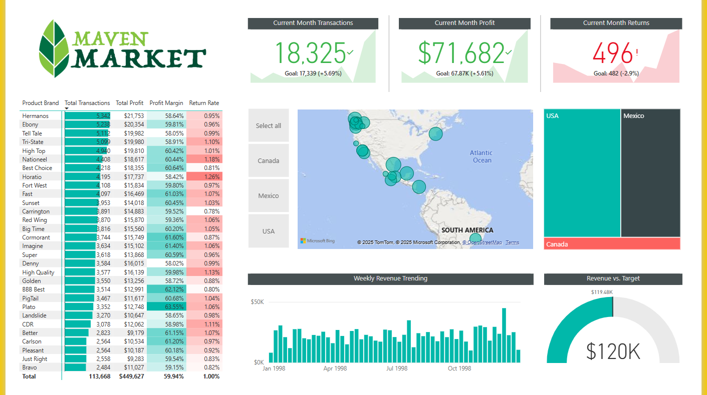

# Maven Market Power BI Dashboard 🛒📊  

## Overview  
This Power BI dashboard provides insights into product sales, transactions, profit margins, and return rates for Maven Market.  

## Features  
- ✅ **Total Transactions & Profit**  
- 📊 **Product Performance Analysis**  
- 🔄 **Return Rate Breakdown**  
- 🌎 **Geographical Sales Distribution**  
- 📈 **Weekly Revenue Trends**  

## Dataset  
- The dataset (`maven_market_data.csv`) contains sales transactions, profit margins, and return data for different product brands.  

## Dashboard Preview  
  

## How to Use  
1. Download the `Maven_Market.pbix` file.  
2. Open it in Power BI Desktop.  
3. Load the dataset and explore insights.  

## Tools Used  
- **Power BI**  
- **Excel / CSV for data cleaning**  
- **DAX for calculations**  
